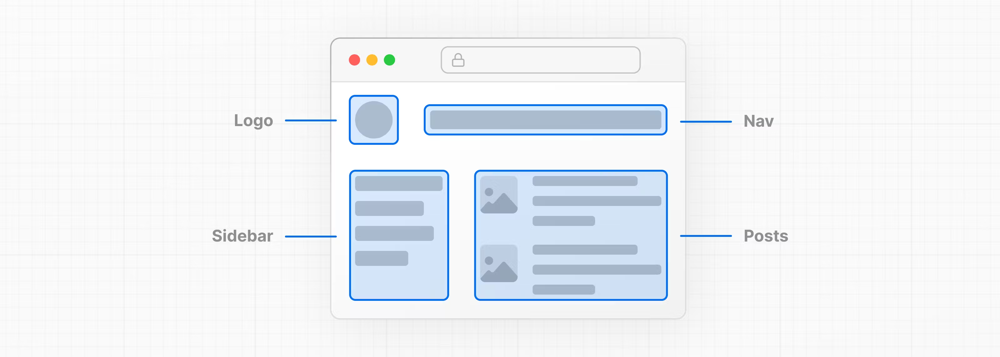
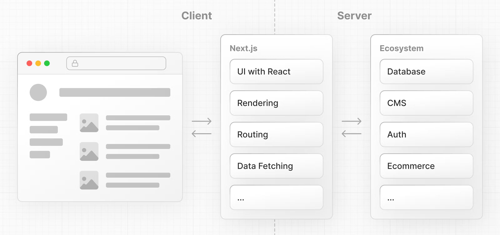
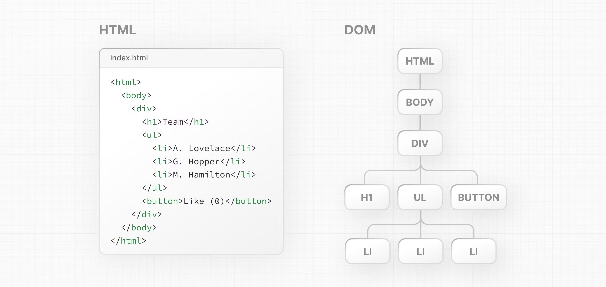
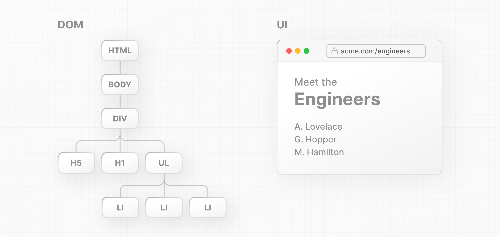

# Learning Next.js && React
https://nextjs.org/learn/react-foundations

## React Foundations

Next.js is a flexible React framework that gives you building blocks to create fast, full-stack web applications.
//Next.js is a flexible React framework that gives you building blocks to create fast, full-stack web application.

## Building blocks of a web application

Building blocks of a web application
There are a few things you need to consider when building modern applications. Such as:

User Interface - how users will consume and interact with your application.
Routing - how users navigate between different parts of your application.
Data Fetching - where your data lives and how to get it.
Rendering - when and where you render static or dynamic content.
Integrations - what third-party services you use (for CMS, auth, payments, etc.) and how you connect to them.
Infrastructure - where you deploy, store, and run your application code (serverless, CDN, edge, etc.).
Performance - how to optimize your application for end-users.
Scalability - how your application adapts as your team, data, and traffic grow.
Developer Experience - your team's experience building and maintaining your application.
For each part of your application, you will need to decide whether you will build a solution yourself or use other tools, such as packages, libraries, and frameworks.

## What is React 
React is a JavaScript library for building interactive user interfaces.
React is a JavaScript library for building interactive user interfaces.

## What is Next.js
Next.js is a React framework that gives you building blocks to create web applications.
// Next.js is a React framework that gives you building blocks to create web applications.
By framework, we mean Next.js handles the tooling and configuration needed for React, and provides additional structure, features, and optimizations for your application.

By framework, we mean Next.js handles the tooling and configuration needed for React, and provides additional structure,
features, and optimizations for your application.

You can use React to build your UI, then incrementally adopt Next.js features to solve common application requirements such as routing, data fetching, and caching - all while improving the developer and end-user experience.

Whether you're an individual developer or part of a larger team, you can use React and Next.js to build fully interactive, highly dynamic, and performant web applications.

You can use React to build your UI, then incrementally adopt Next.js features to solve common application requirements such as routing, data fetching ,and caching - all while improving the developer and end-user experience.

Whether you're an individual developer or part of a larger team, you can use React and Next.js to build fully interactive, highly dynamic, and performant web applications.

## Rendering User Interfaces (UI)

The DOM is an object representation of the HTML elements. It acts as a bridge between your code and the user interface, and has a tree-like structure with parent and child relationships.

The DOM is an object representation of the HTML elements. It acts as a bridge between your code and the user interface, and has a tree-like structure with parent and child relationships.

!!You can use DOM methods and JavaScript ,to listen to user events and manipulate the DOM by selecting, adding ,updating, and deleting specific elements in the user interface. DOM manipulation allows you to not only target specific elements, but also change their style and content.

## Imperative vs. declarative programming
In other words, imperative programming is like giving a chef step-by-step instructions on how to make a pizza. Declarative programming is like ordering a pizza without being concerned about the steps it takes to make the pizza

In other words, imperative programming is like giving a chef step-by-step instructions on how to make a pizza. Declarative programming is like ordering a pizza without being concerned about the steps it takes to make the pizza.

React is a popular declarative library that you can use build user interfaces.
React is a popular declarative library that you can use build user interfaces.

## React: A declarative UI library
As a developer, you can tell React what you want to happen to the user interface, and React will figure out the steps of how to update the DOM on your behalf.

As a developer, you can tell React what you want to happen to the user interface, and React will figure out the steps of how to update the DOM on your behalf.
## Getting Started with React
To use React in your newly created project, load two React scripts from an external website called 
unpkg.com:https://unpkg.com/

react is the core React library.
react-dom provides DOM-specific methods that enable you to use React with the DOM.

react is the core React library.
react-dom provides DOm-specific methods that enable you to use React with the DOM.
