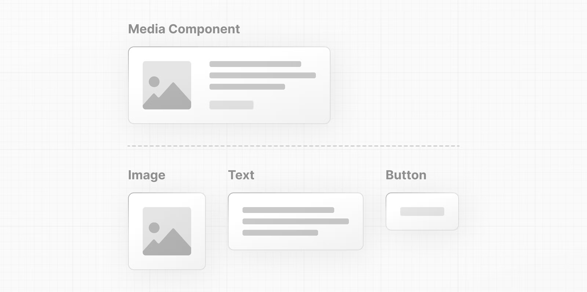
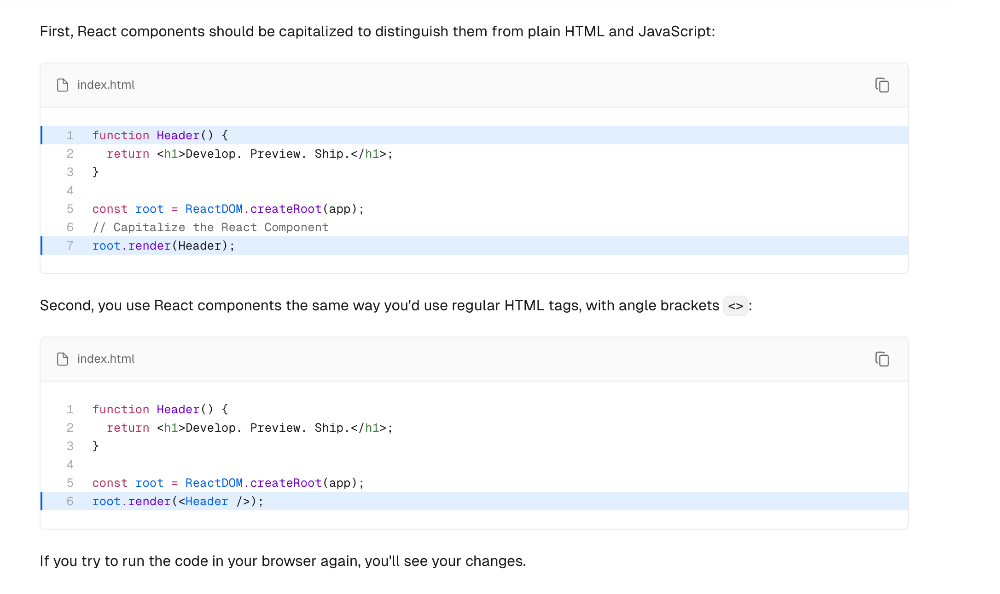
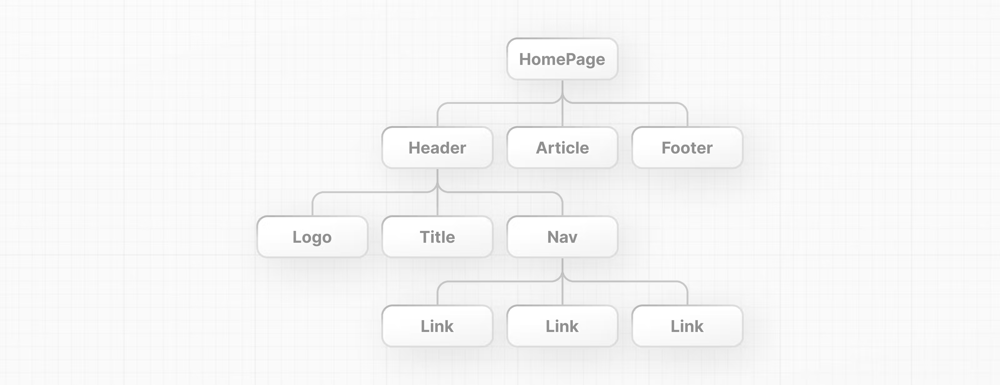
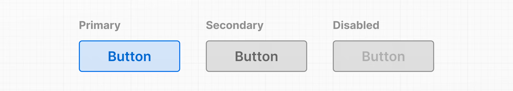
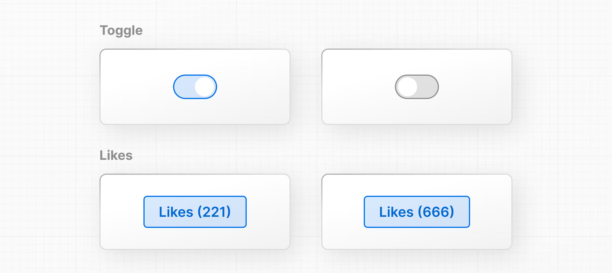
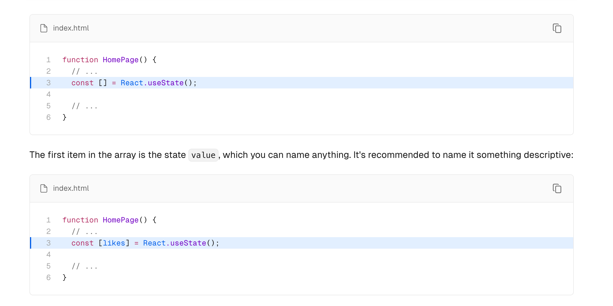

# Learning Next.js && React
https://nextjs.org/learn/react-foundations

## React Foundations

Next.js is a flexible React framework that gives you building blocks to create fast, full-stack web applications.
//Next.js is a flexible React framework that gives you building blocks to create fast, full-stack web application.

## Building blocks of a web application

Building blocks of a web application
There are a few things you need to consider when building modern applications. Such as:

User Interface - how users will consume and interact with your application.
Routing - how users navigate between different parts of your application.
Data Fetching - where your data lives and how to get it.
Rendering - when and where you render static or dynamic content.
Integrations - what third-party services you use (for CMS, auth, payments, etc.) and how you connect to them.
Infrastructure - where you deploy, store, and run your application code (serverless, CDN, edge, etc.).
Performance - how to optimize your application for end-users.
Scalability - how your application adapts as your team, data, and traffic grow.
Developer Experience - your team's experience building and maintaining your application.
For each part of your application, you will need to decide whether you will build a solution yourself or use other tools, such as packages, libraries, and frameworks.

## What is React 
React is a JavaScript library for building interactive user interfaces.
React is a JavaScript library for building interactive user interfaces.

## What is Next.js
Next.js is a React framework that gives you building blocks to create web applications.
// Next.js is a React framework that gives you building blocks to create web applications.
By framework, we mean Next.js handles the tooling and configuration needed for React, and provides additional structure, features, and optimizations for your application.

By framework, we mean Next.js handles the tooling and configuration needed for React, and provides additional structure,
features, and optimizations for your application.

You can use React to build your UI, then incrementally adopt Next.js features to solve common application requirements such as routing, data fetching, and caching - all while improving the developer and end-user experience.

Whether you're an individual developer or part of a larger team, you can use React and Next.js to build fully interactive, highly dynamic, and performant web applications.

You can use React to build your UI, then incrementally adopt Next.js features to solve common application requirements such as routing, data fetching ,and caching - all while improving the developer and end-user experience.

Whether you're an individual developer or part of a larger team, you can use React and Next.js to build fully interactive, highly dynamic, and performant web applications.

## Rendering User Interfaces (UI)

The DOM is an object representation of the HTML elements. It acts as a bridge between your code and the user interface, and has a tree-like structure with parent and child relationships.

The DOM is an object representation of the HTML elements. It acts as a bridge between your code and the user interface, and has a tree-like structure with parent and child relationships.

!!You can use DOM methods and JavaScript ,to listen to user events and manipulate the DOM by selecting, adding ,updating, and deleting specific elements in the user interface. DOM manipulation allows you to not only target specific elements, but also change their style and content.

## Imperative vs. declarative programming
In other words, imperative programming is like giving a chef step-by-step instructions on how to make a pizza. Declarative programming is like ordering a pizza without being concerned about the steps it takes to make the pizza

In other words, imperative programming is like giving a chef step-by-step instructions on how to make a pizza. Declarative programming is like ordering a pizza without being concerned about the steps it takes to make the pizza.

React is a popular declarative library that you can use build user interfaces.
React is a popular declarative library that you can use build user interfaces.

## React: A declarative UI library
As a developer, you can tell React what you want to happen to the user interface, and React will figure out the steps of how to update the DOM on your behalf.

As a developer, you can tell React what you want to happen to the user interface, and React will figure out the steps of how to update the DOM on your behalf.
## Getting Started with React
To use React in your newly created project, load two React scripts from an external website called 
unpkg.com:https://unpkg.com/

react is the core React library.
react-dom provides DOM-specific methods that enable you to use React with the DOM.

react is the core React library.
react-dom provides DOm-specific methods that enable you to use React with the DOM.

Instead of directly manipulating the DOM with plain JavaScript, remove the DOM methods that you had added previously, and add the ReactDOM.createRoot() method to target a specific DOM element and create a root to display your React components in.
Then, add the root.render() method to render your React code to the DOM.

This will tell React to render our <h1> title inside our #app element.

## learn React
https://react.dev/learn/writing-markup-with-jsx#the-rules-of-jsx

JSX is a syntax extension for JavaScript that allows you to describe your UI in a familiar HTML-like syntax
JSX is a syntax extension for JavaScript that allows you to describe your UI in a familiar HTML-like syntax

But browsers don't understand JSX out of the box, so you'll need a JavaScript compiler, such as a Babel, to transform your JSX code into regular JavaScript.

But browsers don't understand JSX out of the box, so you'll need a JavaScript compiler, such as a Babel, to transform your JSX code into regular JavaScript.
babel:https://babeljs.io/

## React important
You can start to see how using React enables you to cut down a lot of repetitive code.
And this is exactly what React does, it's a library that contains reusable snippets of code that perform tasks on your behalf - in this case, updating the UI
## React core concepts

There are three core concepts of React that you'll need to be familiar with to start building React applications. These are:

Components
Props
State

There are three core concepts: Components , Props, State
# Components

Users interfaces can be broken down into smaller building blocks called components.
 
like LEGO bricks

The nice thing about React components is that they are just JavaScript.
The nice thing about React components is that they are just JavaScript.

Creating components
In React, components are functions. Inside your script tag, create a new function called header:

In React, components are functions.

A component is a function that returns UI elements. Inside the return statement of the function, you can write JSX:

index.html

A component is a function that returns UI elements. Inside the return statement of the function, you can write JSX: 

First, React components should be capitalized to distinguish them from plain HTML and JavaScript:
Second, you use React components the same way you'd use regular HTML tags, with angle brackets <>:
//First, React components should be capitalized to distinguish them from plain HTML and JavaScript:
//Second, you use React components the same way you'd use regular HTML tags, with angle brackets <>:
## Nesting components
Applications usually include more content than a single component. You can nest React components inside each other like you would regular HTML elements.

In your example, create a new component called HomePage:

Applications usually  include more content than a single component. You can nest React components inside each other like your would regular HTML elements.

# components tree

This modular format allows you to reuse components in different places inside your app.
// This modular format allows you to reuse components in different places inside your app.

## Using Props

In your HomePage component, you can pass a custom title prop to the Header component, just like you'd pass HTML attributes:

In your HomePage component, you can pass a custom title prop to the Header component, just like you'd pass HTML attributes:

Destructuring assignment
## Iterating through lists

It's common to have data that you need to show as a list. You can use array methods to manipulate your data and generate UI elements that are identical in style but hold different pieces of information.

Add the following array of names to your HomePage component:

It's common to have data that you need to show as a List. You can use array methods to  manipulate your data and generate UI 
elements that are identical in style but hold different pieces of information.
# interactive with State 
In React, event names are camelCased. The onClick event is one of many possible events you can use to respond to user interaction. For example, you can use onChange for input fields or onSubmit for forms.

In React, event names are camelCased. The onClick event is one of many possible events you can use to respond to user interaction. For example,you can use onChange for input fields or onSubmit for forms.

# State and hooks
React has a set of functions called hooks. Hooks allow you to add additional logic such as state to your components. You can think of state as any information in your UI that changes over time, usually triggered by user interaction.

You can use state to store and increment the number of times a user has clicked the "Like" button. In fact, the React hook used to manage state is called: useState()

// Add useState() to your project. It returns an array, and you can access and use those array values inside your component
using array destructuring.

The first item in the array is the state value, which you can name anything. It's recommended to name it something descriptive:

The first item in the array is the state value, which you can name anything. It's recommended to name it something descriptive.
//
The second item in the array is a function to update the value. You can name the update function anything, but it's common to prefix it with set followed by the name of the state variable you're updating:

The second item in the array is a function to update the value. You can name the update function anything, but it's common 
to prefix it with set followed by the name of the state variable you're updating:
You can also take the opportunity to add the initial value of your likes state to 0:
You can also take the opportunity to add the initial value of your likes state to 0:

3://Finally, you can call your state updater function, setLikes in your HomePage component, let's add it inside the handleClick() function you previously defined:
Finally, you can call your state updater function, setLikes in your HomePage component, let's add it inside the handleClick() function you previously defined:
## important
Clicking the button will now call the handleClick function, which calls the setLikes state updater function with a single argument of the current number of likes + 1.

Note: Unlike props which are passed to components as the first function parameter, the state is initiated and stored within a component. You can pass the state information to children components as props, but the logic for updating the state should be kept within the component where state was initially created.

Clicking the button will now call the handle Click function, which calls the setLikes  updater function with a single argument of the current number of likes +1.